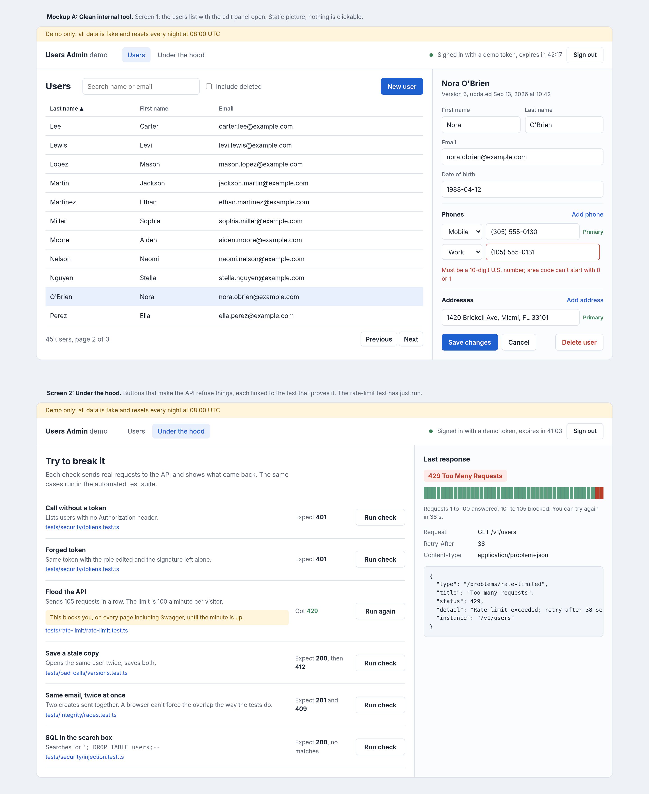
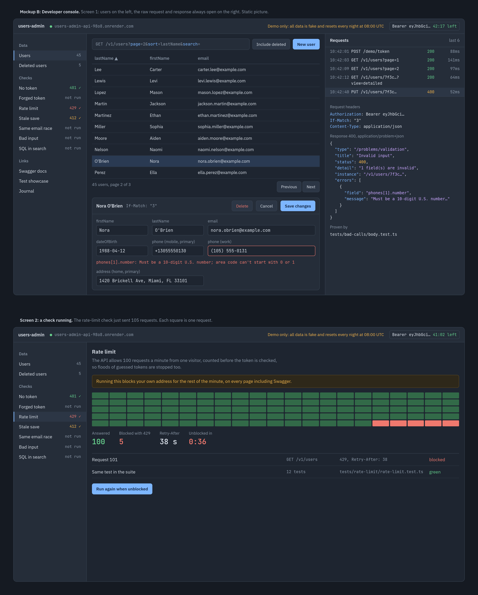
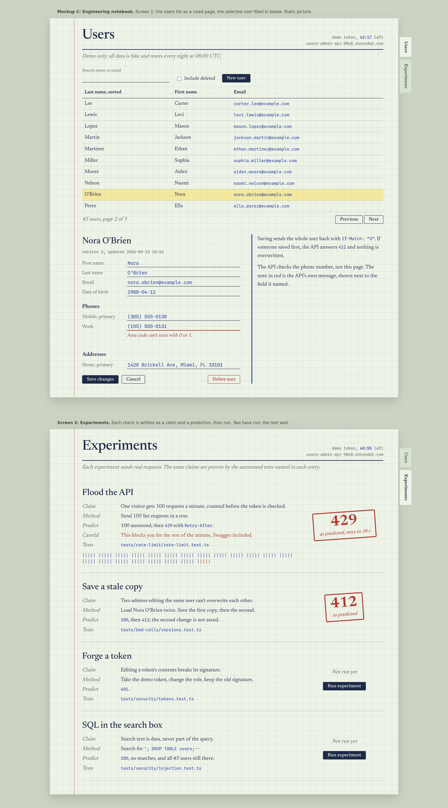
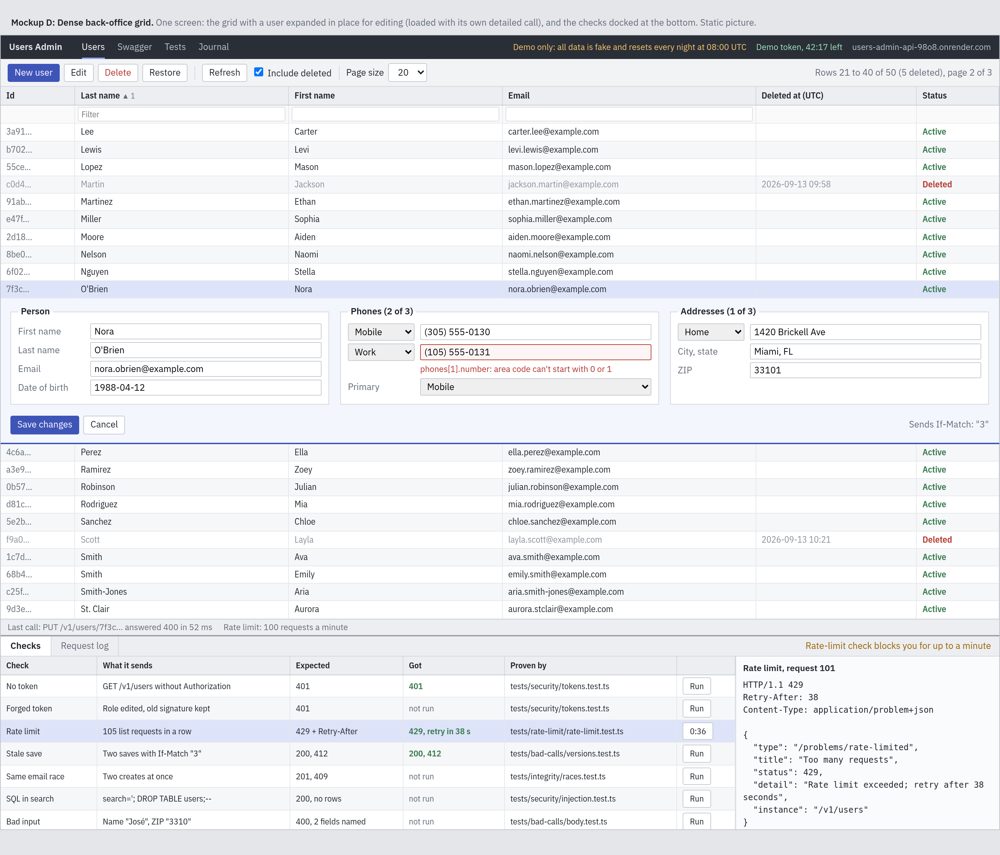
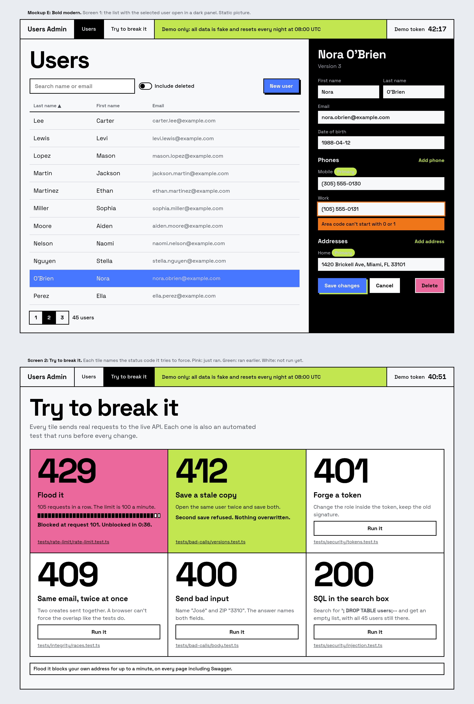
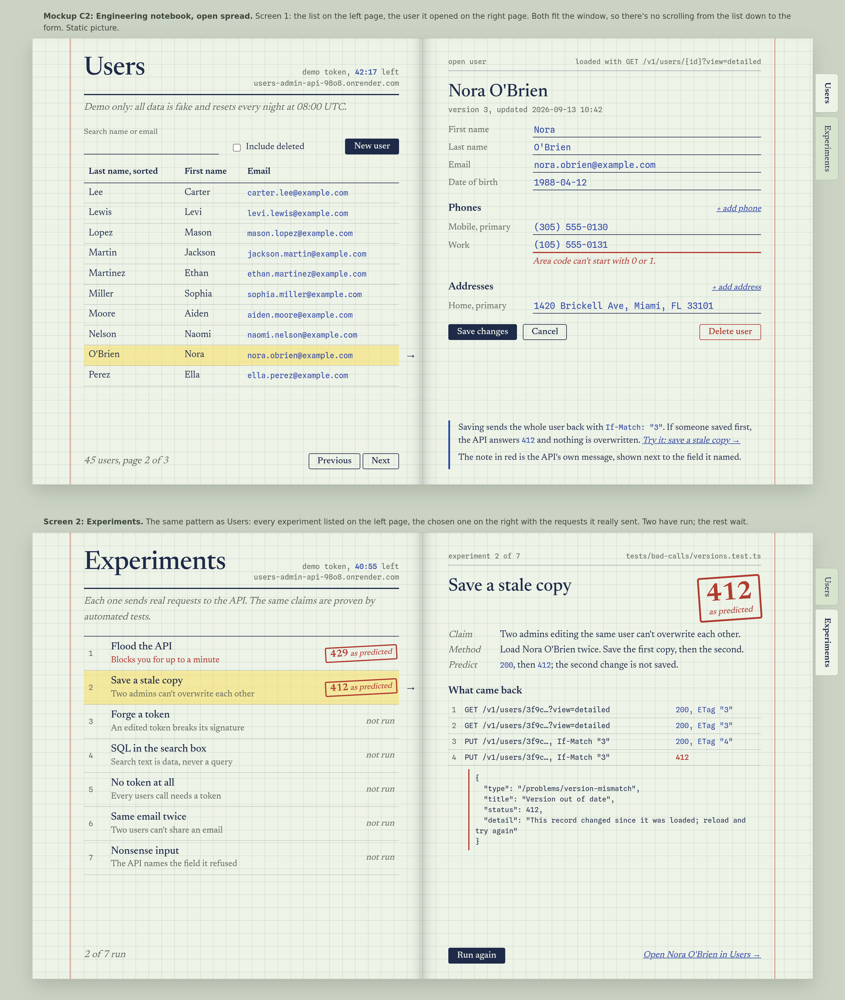

# 13 — Admin web client

**Date:** 2026-09-13 · **Status:** Decided and built: [live on Render](https://users-admin-web.onrender.com)

A single-page app in `website/` that calls the live API, hosted as a Render static site ([decision 05](05-hosting.md#web-client-on-render-not-netlify-2026-09-13)). Besides the usual list, create, edit, delete, and restore, it has a place for visitors to watch the API refuse things: get a token, flood the rate limit, save a stale copy, and so on.

## Look and feel: the engineering notebook (2026-09-13)

Before any code, the AI made 5 static mockups in [`website/public/mockups/`](../../../website/public/mockups/), each showing the same two screens (users, and the checks) so only the look differed.

Click a picture for the full page.

| # | Picture | Mockup | Look | Checks screen |
|---|---|---|---|---|
| A |  | Clean internal tool | Light, one blue accent, edit panel on the right | List of checks, last response beside it |
| B |  | Developer console | Dark slate, 3 panes, request log always open | 105-square grid for the rate-limit run |
| **C** |  | **Engineering notebook (picked)** | **Green grid paper, ink blue, red pencil; Newsreader + Spline Sans Mono** | **Each check is an experiment: claim, method, prediction, stamped result** |
| D |  | Dense back-office grid | Small type, 20 rows, edit inside the row | Checks docked at the bottom |
| E |  | Bold modern | Big type, thick black lines, bright color | Tiles led by a giant status code |

**Seeing, not just reading.** I asked that visitors can see the mockups, not only read about them:

- **Screenshots** (above): 1440 px wide pages at 2× sharpness, taken in Chrome's device toolbar with "Capture full size screenshot". My first try was a picture of my screen (1912 × 858, zoomed, cut off), and it showed a real layout bug: form boxes running past their column in A, B, C, and E. Fixed before retaking
- **The pages themselves** live in `website/public/`, so Vite copies them into the build and they're served with the client at `/mockups/index.html` (the full name: the dev server answers `/mockups/` with the app, not the folder's index)

**Picked C.** Why:

- **Non-technical visitors can follow it.** "Claim, predict, result" reads as plain language, not an HTTP console
- It matches how the project was built: every test was predicted to fail before it was run (see the [journal](../journal.md))

**Origin:** picked (the AI proposed the 5 directions; I chose C for non-technical visitors)

**Found while making the mockups:** the list call returns only `id`, `firstName`, `lastName`, `email` (and `deletedAt` with `includeDeleted`). The first drafts showed city, phone count, and version in the table, which would need one extra call per row. Removed: the table shows what the list returns, and the full user loads when one is opened.

## Layout: the notebook lies open (2026-09-13)

**The problem with C as picked:** the users screen put the list on top and the opened user below it, so every edit meant scrolling down to the form and back up to the list.

| Option | Downside |
|---|---|
| **Two-page spread: list on the left page, opened user on the right** | Needs a wide screen (fine: [big screens only](#screen-size-big-screens-only-2026-09-13)) |
| Slide-over panel from the right | Covers the list while editing |
| Pop-up dialog | Cramped once a user has several phones and addresses |
| Its own page (`/users/:id`) | An extra click each way; the list is out of sight |
| Row opens in place | Pushes the rows below it down, so the scroll comes back |

**Picked the spread**, drawn as [mockup C2](../../../website/public/mockups/c2-notebook-spread.html):

- It fits the notebook look: an open notebook has two facing pages
- Both pages are as tall as the window; each scrolls on its own only if its content is taller
- The Experiments tab works the same way: all experiments listed on the left page with a small status each, the chosen one on the right with the requests it sent and what came back. **First drawn as two entries per page:** the screenshot showed the half-width pages made the text wrap until the second entry ran off the page, so it was redrawn as list and detail
- Small links join the two screens, like "Try it: save a stale copy →" next to the saving note
- The tabs already kept the experiments off the admin's screen; this only fixes the scroll inside the users screen

**Origin:** mine to fix the scroll; the AI listed the 5 options and recommended the spread, and I agreed

## Stack: Vite + React + TypeScript (2026-09-13)

| Option | Pros | Cons |
|---|---|---|
| Plain HTML, CSS, JS (no build) | Nothing to install; Render publishes the folder as is; every line easy to follow | Hand-written page updates and screen switching; no type checking; weaker on a résumé |
| Vite + TypeScript, no framework | Same language as the API; types generated from `openapi.yaml`; small | A build step; still hand-written page updates |
| **Vite + React + TypeScript** | What most employers expect; components suit the repeated experiment entries and phone/address rows; same generated types | More packages and more to explain; I learn React along the way |

- **Types generated from the spec** carry "spec first" into the client: if the spec changes, the client stops compiling
- Vite builds a plain static folder, which is what a Render static site serves
- **I'm much more familiar with plain JS,** but chose React because it's what the project should show

**Origin:** suggested (I accepted the AI's recommendation over the option I know best)

## Screen size: big screens only (2026-09-13)

The client is built for a desktop or laptop screen, about 1280 px wide or more. No phone or tablet layout.

- It's an admin tool: people manage users at a desk, not on a phone
- A phone layout would double the layout work and the screenshots for no one who would really use it
- A visitor on a phone can still read the README, the journal, and the screenshots

**Origin:** mine

## Project setup (2026-09-13)

- **`website/` is the Vite project** (Render's root directory will be `website`); the mockups stay in `public/mockups/` and ship with the build
- **The AI wrote a small set of files by hand** instead of running `npm create vite`, which wants an empty folder and adds demo files to delete. Same `.nvmrc` (Node 24.21.0) and exact-version `.npmrc` as the API
- **Tests in `website/tests/`**, like the API's `project/tests/`: Vitest with jsdom (a fake browser page inside Node) and React Testing Library, one file at a time
- **Started red:** the first test (the app opens on "Users" with the demo notice) ran against an app that shows nothing, failed as predicted, then passed

| Package | Version | Why |
|---|---|---|
| `react`, `react-dom` | 19.3.0 | The UI |
| `vite`, `@vitejs/plugin-react` | 8.3.0, 6.1.1 | Dev server and build into `dist/` |
| `typescript` | 7.0.2 | Same as the API; `npm run build` type-checks first |
| `vitest`, `jsdom` | 5.0.0, 30.0.1 | Tests without opening a browser |
| `@testing-library/react`, `/dom`, `/jest-dom` | 16.3.3, 10.4.2, 7.0.1 | Find things the way a person does (by role and text); `/dom` must be installed alongside `/react` |

Added with the first API tests:

| Package | Version | Why |
|---|---|---|
| `openapi-fetch` | 0.17.0 | API calls checked against the types generated from `openapi.yaml` (`npm run api:types`, pinned `openapi-typescript` 7.13.0 via `npx`, since it needs TypeScript 5) |
| `msw` | 2.15.0 | A fake API inside the tests; a request it has no answer for fails the test |

**Fonts (2026-09-13):** Newsreader and Spline Sans Mono installed as packages (`@fontsource-variable/newsreader`, `@fontsource-variable/spline-sans-mono`, 5.3.0) instead of a Google Fonts link: pinned versions and no request to Google from visitors' browsers. **Origin:** suggested (I agreed)

**Only working controls on screen:** search, paging, tabs, and New user appear when they work, not as dead buttons.

**The token (2026-09-13):** kept in memory only, so a reload starts over and nothing stays saved in the browser. **Origin:** suggested (I agreed). At first the app also got it automatically on open; [revised below](#the-demo-token-on-screen-2026-09-13).

**Tests never reach Render,** guarded twice: the client looks up `fetch` on every call so MSW can catch it (without that, the first run quietly called the live API), and tests point at `http://fake-api.test`, which can't exist. Checked by removing the first guard on purpose ([journal row 51](../journal.md)).

## The demo token on screen (2026-09-13)

After opening a user worked, **I asked why the list was showing at all:** the app quietly got a demo token on open, and nothing on screen said so.

| Question | Options | Picked |
|---|---|---|
| What replaces the list without a token | **A notebook page explaining why** (in plain words, with the API's own answer and a Try again button; the right page explains what the demo token is) · one red line and a Try again button | **The explaining page** |
| How the token is got | Automatically on open, shown in the corner · **a Get demo token button first** | **The button** (reversing the automatic pick) |
| When the hour runs out | **Show it** (the list is replaced by "Your demo token expired" and a Get a new token button) · renew quietly | **Show it** |

- **Why the button:** visitors see that an API like this needs a pass before anything else, and that this demo hands one out; nothing happens behind their back
- **Why show expiry:** it's the API enforcing the token's `exp`, one of the security tests, seen by a person instead of only by a test

**Origin:** picked (the AI gave the options, recommending automatic; I chose the button, and the explaining page and visible expiry as recommended)

**Built (2026-09-13):** 5 states in `src/token/useDemoToken.ts` (none, getting, failed, active, ended as expired or refused); the pages in `src/token/NoTokenPages.tsx`; the corner shows `no token`, `demo token, 59:12 left`, `demo token expired`, or `demo token refused`. The countdown uses the visitor's clock from `expiresIn`. A `429` counts down from `Retry-After` (the API already exposes that header to browsers). **A late `401` for an old token can't end a new one,** guarded twice (checked by removing each guard, [journal row 55](../journal.md)). 8 tests in `website/tests/token/`.

## Paging and search (2026-09-13)

Checking the spec first found two traps: `search` must be 1–100 characters (so an empty box must leave it out, or the API answers `400`), and `%` and `_` are plain characters.

| Question | Picked | Other option |
|---|---|---|
| When the search runs | **As you type, after a 300 ms pause**: fast typing sends one request, which matters with 100 requests a minute | Only on Enter or a Search button |
| Spaces-only or empty box | **Trimmed; empty means no search** | Sent as typed, and the API answers `400` |
| Over 100 characters | **The box stops at 100**, so it can't send what the API refuses; showing that `400` belongs in Experiments | Let it through and show the API's `400` |
| Page past the end (users deleted, or the nightly reset) | **Say so**, with a button to the last page | Jump there silently |

- A new search starts at page 1; while a page loads, the old rows stay visible, faded, and the buttons pause
- The opened user stays open while paging or searching

**Origin:** suggested (the AI's picks; I agreed)

## Add, edit, delete, restore (2026-09-13)

I asked for all four as one step, since they share one form. 11 picks, all the AI's, approved together:

| # | Question | Picked |
|---|---|---|
| 1 | Validation | **The API decides.** The form doesn't repeat the rules; each `400` message shows next to the field it names (`email`, `phones.1.number`). Only input types help: a date picker, dropdowns for types and the state |
| 2 | The form | Always editable on the right page, like mockup C2; **New user** opens it empty; Save and Cancel turn on once something changes |
| 3 | Phones and addresses | 1 row each to start; add up to 3, remove down to 1; one primary per list, automatic with one |
| 4 | After creating | The list reloads; the new user stays open |
| 5 | `409` | Email taken: next to Email. User limit: a message above Save |
| 6 | `412` on save | "Someone saved this user first. Nothing of yours was saved." + **Load their version** |
| 7 | Unsaved changes, then another user or New user | Blocked: "You have unsaved changes: Save or Cancel first" |
| 8 | Delete | Confirmed on the page, not a browser pop-up; sent with `If-Match`, so a stale copy gets `412` |
| 9 | Deleted users | **Include deleted** checkbox; deleted rows faded and marked; opening one shows it read-only with **Restore** |
| 10 | Restore | One click; if someone restored it first (`409`), say so and reload |
| 11 | Opening a user | Always with `includeDeleted=true`, so a user deleted meanwhile shows as deleted with Restore; only a user that's truly gone gets `404` |

**Origin:** suggested (I approved all 11 at once, to keep going)

## Experiments tab (2026-09-13)

**My direction, to finish the portfolio:** show all 7 experiments as in mockup C2, but run only the flood for real. The other 6 show their stamp without a click, and **Replay the test** plays back the requests their automated test sends, labeled as a replay ("Nothing was sent from your browser"), since sending them from a public demo would change other visitors' data. **The flood goes first, marked "runs live"**, so visitors don't click through replays and assume it's fake too.

| # | Experiment | Stamp | On this page |
|---|---|---|---|
| 1 | Flood the API | what really happened | **Runs live:** 150 requests at once, without a token |
| 2 | No token at all | 401 | Replay of `auth-first.test.ts` |
| 3 | Forge a token | 401 | Replay of `tokens.test.ts` |
| 4 | Save a stale copy | 412 | Replay of `versions.test.ts` |
| 5 | Same email twice | 409 | Replay of `conflicts.test.ts` |
| 6 | Nonsense input | 400 | Replay of `body.test.ts`, with the API's real messages |
| 7 | SQL in the search box | 200 | Replay of `injection.test.ts`, plus the firewall finding (decision 14) |

- Tabs are notebook dividers; both tabs stay on the page (one hidden), so unsaved edits and a running flood survive switching
- **The flood, first sent one request at a time, got "105 answered, and no 429"** on its first live run. The API's limit was fine (120 requests at once from `curl`: 93 answered, 27 refused); the requests had most likely crossed a minute boundary, where the API's count starts over. **I asked why it wasn't a real flood:** the AI had copied the mockup's "in a row" without questioning it. Now all 150 go at once, and the page explains more than 100 answers as a new minute starting mid-flood
- **Known trade-off, found by this:** fixed one-minute windows let a well-timed client get up to 200 requests in a few seconds, around the boundary. Not changed

**Origin:** mine (only the flood live, flood first, stamps without a click, a real flood); the AI suggested replays for the other 6

## Still open

- ~~How the users screen and the experiments work~~ Done (sections above)
- ~~Deploy as a Render static site~~ Done: auto-deploy off, `CORS_ORIGINS` updated ([05](05-hosting.md#web-client-on-render-not-netlify-2026-09-13))
- Not built, if the project continued: the 6 replayed experiments running live, a request inspector, a `curl`-with-your-token entry, and links from the Users screen to matching experiments
